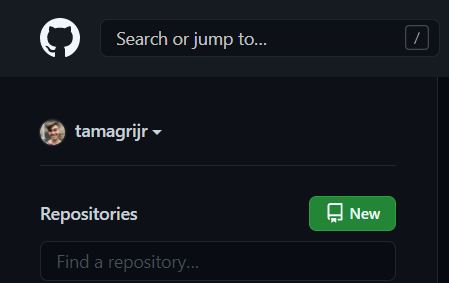
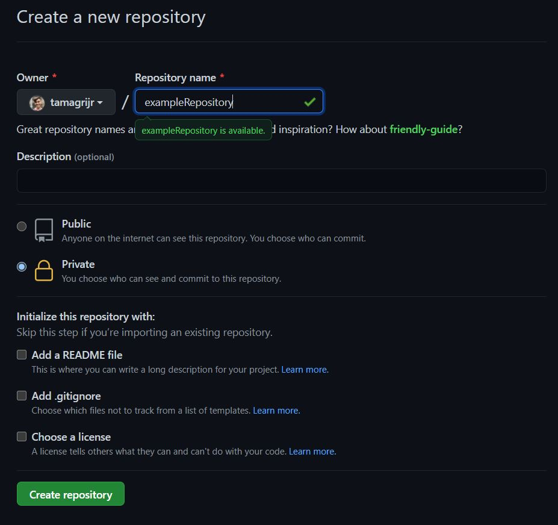
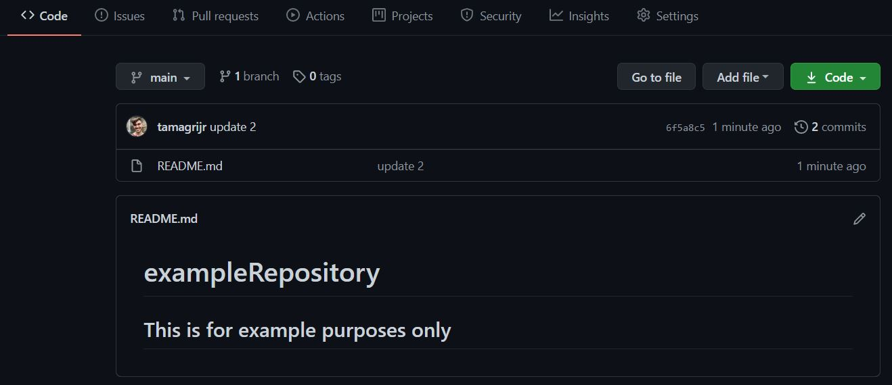
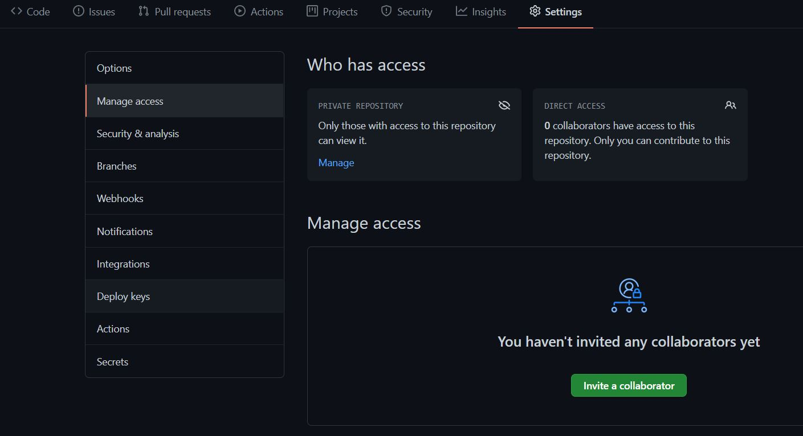
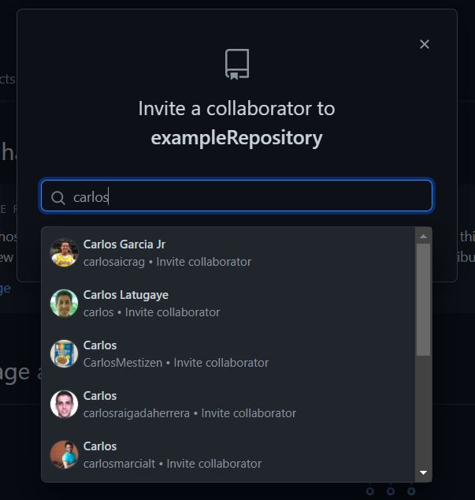
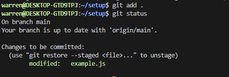
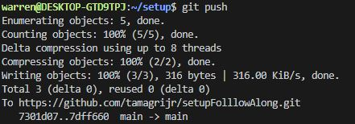

# Git Flow and Commands

## Jump to what you need

- [Basic Git Commands](#basic-git-commands)
- [Pairing Setup](#basic-setup-for-pairing)
  - [Creating a GitHub Repo](#creating-a-repo)
  - [Connecting to a GitHub Repo](#cloning-a-repo)
- [Git Flow](#basic-git-flow-for-pairing)

---

## Basic [git commands](https://git-scm.com/docs)

**These commands are for git on your local computer, git and github
are two separate things. If you're curious
[git vs. github](https://www.geeksforgeeks.org/difference-between-git-and-github/).**

- Get and Create Projects
  - [git init](https://git-scm.com/docs/git-init)  
  Creates an empty git repository inside your present working directory
  - [git clone *`"github-link"`*](https://git-scm.com/docs/git-init)  
  Creates a copy of the specified git repository inside your present working directory
- Save Your Work
  - [git status](https://git-scm.com/docs/git-status)  
  Shows the current working state of the git repository
  - [git add *`"file-name"`*](https://git-scm.com/docs/git-add)  
  Add files to the staging area, you can use the dot operator to add everything  
  to the staging area by typing *`git add .`*
  - [git commit -m *`"commit-message"`*](https://git-scm.com/docs/git-commit)  
  Records all the added changes to the repository, write meaningful messages to  
  remind yourself of what was done to the project
- Share Your Work
  - [git remote add origin *`"github-link"`*](https://git-scm.com/docs/git-remote)  
  Connects your local git repository to a specified github repository, you should  
  only have to do this once and you will not have to do this if you used *`git clone`*
  - [git push](https://git-scm.com/docs/git-push)  
  Updates github with any changes that have been committed on the local git  
  repository, think uploading
  - [git pull](https://git-scm.com/docs/git-pull)  
  Updates your local git repository with any changes made to github, think downloading
- Other Useful Commands
  - *`git branch -M main`*  
  Tech is ever evolving and in keeping up with the times it's best to be proactive  
  and change our main branch name to something more appropriate. This is a trend  
  in tech that you should get used to.

---

## Basic setup for pairing

**_Important:_ First determine who will create the repo on GitHub as the  
instructions for each partner will be different.**

### Creating a Repo

- Create a repository on github by pressing the new button in the top left corner of  
your github homepage

  

- Name your repository and be sure to set it to private, also don't press any of the check boxes

  

- Connect your local git repository
  - Once you have created a repository it will bring you to a page with directions for setup
  - Recommended: Create a new local repository by entering these commands one line at a  
  time in the directory that you wish to become a git repository

  

  - Alternative: If you already have a repository set up that you want to push up follow these  
  commands one line at a time

  

- Once you have followed all the commands refresh your github and you should see something  
similar to this

  

- Invite your partner
  - While on the page for the new repo click the settings cog above it should take you to  
  something that looks like this

    

  - Click on Invite Collaborator and search your partner's github username

    

- Lastly, your cohort is your most valuable resource during a/A make sure to follow each other  
on github to make it easier to share projects and work together!

### Cloning a Repo

- Once your pair has created a repository and invited you, you should receive an email  
on the account you linked when you created your github
- After you have accepted the invite in your email you should be redirected to  
something that looks like this  

- After accepting the invitation you will be redirected to the github repository  
where you can copy the link  

- Inside the directory you want to copy the project into run the command  
*`git clone "copied-link"`*
- You should now have all of the files and directories on your local machine, don't forget  
to follow your partner on github!

---

## Basic git flow for pairing

Once you and your pair are set up and working on the same repository things get a lot easier. As you switch back and forth from driver to navigator you will need to follow these steps.

Steps for the driver:

- Create a .gitignore file in the root folder of your project repo and on the first line of the file type /node_modules

  

- Save your work

- Type ``git status`` into your terminal, you should see something like this:

  

- Type ``git add .`` in order to add all of your changes to the staging area
- Retype ``git status`` in order to confirm everything worked correctly:

  

- Type ``git commit -m <meaningful_commit>`` replacing meaningful_commit with your message
- Retype ``git status`` one last time:

  

- Type ``git push`` in order to send it up to GitHub:

  

- Wait for the navigator to pull
- Begin navigating

Steps for the navigator:

- Wait for the driver to push
- Type ``git pull``
- Begin driving
