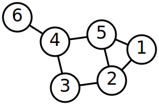

# M2-W12-D2

- Quick/Merge Sort
- Intro to Graphs

## Quick Sort (20m)

## Merge Sort (20m)

## Graphs

### What is a graph?

**...EVERYTHING!**

- Linked Lists
- Trees
- anything with a node and a pointer!

### Graph Vocabulary

- Vertex: A node in the graph. Vertex and node can be used interchangeably
- Directed edge: A one-way connection from one vertex to another
- Undirected edge/Bidirectional edge: A two-way connection between two vertices
  that can be traversed in either direction
- Edge weight: The cost of traversing an edge. (This would be equivlent to the
  lines/edges in the whole graph having lengths)
- Cyclic/acyclic: A cyclic graph is a graph with at least 1 cycle, or the
  potential to have a cycle

---

### Adjacency Lists


```js
const graph1 = {
  T: ['V'],
  U: ['V'],
  V: [],
}
const graph2 = {
  X: ['Y'],
  Y: ['Z'],
  Z: ['X'],
}
const graph3 = {
  A: ['B', 'C', 'E'],
  B: [],
  C: ['B', 'D'],
  D: [],
  E: ['A'],
  F: ['E'],
}
```



```js
//an undirected graph may look like this:
const undirected = {
  1: [2, 5],
  2: [1, 3, 5],
  3: [2, 4],
  4: [3, 5, 6],
  5: [1, 2, 4],
  6: [4],
}
```

---

## Traversing Graphs (Example Patterns)

### BFS

- Create a queue and enqueue the starting node
- Create a set to store visited nodes
- While the queue is not empty, repeat steps 4-6
- Dequeue the first node
- DO THE THING THAT YOU NEED TO FOR THE DEQUEUED NODE
- For each unvisited neighbor, add it to the visited nodes and to the back of
   the queue

### DFS

- Create a stack and push the starting node
- Create a set to store visited nodes, and add the starting node
- While the stack is not empty, repeat steps 4-6
- Pop the node on the top of the stack.
- DO THE THING THAT YOU NEED TO FOR THE DEQUEUED NODE
    -  For example, add it to a running total, print it, or save it in an array
- For each unvisited neighbor, add it to the visited nodes and to the top
   of the stack.

---

## REPL Problems

Feel free to copy these problems into VS-Code for a better working environment if you
would like to.

Please take your time to really understand the pattern of these problems,
reference the readings, and ask questions!

We will be doing these problems solo today to give you some time to think
through the patterns at your own pace and to focus on understanding the
readings from your homework.

Think of today as an extended study day/intro to graphs.

---